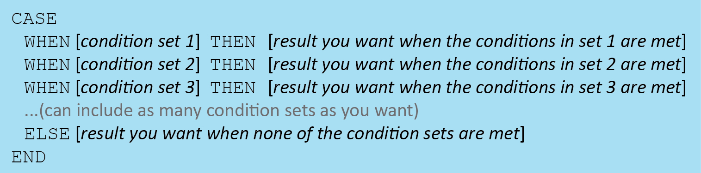
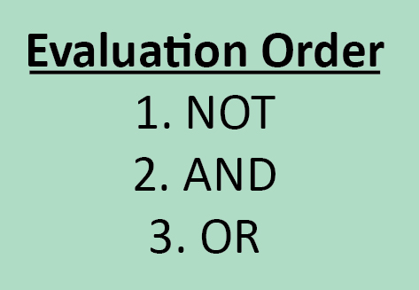

# Week4 Homework Notes

## Some key point about Subqueries

* 1) "On the fly calculations" (or, doing calculations as you need them)
	* ... WHERE TIMESTAMPDIFF(minute,start_time,end_time) > (Subqueries give some AVG time)
* 2) Testing membership
	* IN, NOT IN
	* EXISTS and NOT EXISTS -  can only be used in subqueries
		* unlike IN/NOT IN statements, EXISTS/NOT EXISTS are logical statements. Rather than returning raw data, per se, EXISTS/NOT EXISTS statements* return a value of TRUE or FALSE
* 3) Accurate logical representations of desired output and Derived Tables
	* Rather than joining many duplicated rows and fixing the results later with the GROUP BY clause, it would be much more elegant if we could simply join the distinct UserIDs in the first place.
	```MySQL
	SELECT DistinctUUsersID.user_guid AS uUserID, d.user_guid AS dUserID, count(*) AS numrows
	FROM (SELECT DISTINCT u.user_guid
		FROM users u) AS DistinctUUsersID
	LEFT JOIN dogs d
		ON DistinctUUsersID.user_guid=d.user_guid
	GROUP BY DistinctUUsersID.user_guid
	ORDER BY numrows DESC
	```
	* Since the subquery is in the FROM statement, it actually creates a temporary table, called a derived table, that is then incorporated into the rest of the query.
	* There are several important points to notice about the syntax of this subquery.
		* First, an alias of "DistinctUUsersID" is used to name the results of the subquery. We are required to give an alias to any derived table we create in subqueries within FROM statements. Otherwise there would be no way for the database to refer to the multiple columns within the temporary results we create.
		* Second, we need to use this alias every time we want to execute a function that uses the derived table. Remember that the results in which we are interested require a join between the dogs table and the temporary table, not the dogs table and the original users table with duplicates. That means we need to make sure we reference the temporary table alias in the ON, GROUP BY, and SELECT clauses.
		* Third, relatedly, aliases used within subqueries can refer to tables outside of the subqueries. However, outer queries cannot refer to aliases created within subqueries unless those aliases are explicitly part of the subquery output.
		* Another thing to take note of is that when you use subqueries in FROM statements, the temporary table you create can have multiple columns in the output (unlike when you use subqueries in outside SELECT statements). But for that same reason, subqueries in FROM statements can be very computationally intensive. Therefore, it's a good idea to use them sparingly, especially when you have very large data sets.

### Questions about efficiency diff between JOIN and EXISTS
Why
```
%%sql
SELECT DISTINCT u.user_guid AS uUserID
FROM users u
WHERE EXISTS (SELECT *
              FROM dogs d
              WHERE u.user_guid =d.user_guid);
```
faster than
```
%%sql
SELECT DISTINCT u.user_guid AS uUserID
FROM users u JOIN dogs d ON u.user_guid=d.user_guid;
```

Overall, subqueries and joins can often be used interchangeably. Some people strongly prefer one approach over another, but there is no consensus about which approach is best. When you are analyzing very large datasets, it's a good idea to test which approach will likely be faster or easier to troubleshoot for your particular application.

#### Some subquery samples

Use a NOT EXISTS clause to examine all the users in the dogs table that are not in the users table (you should get 2 rows in your output).
```
%%sql
SELECT d.user_guid
FROM dogs d
WHERE NOT EXISTS (SELECT *
                  FROM users u
                  WHERE u.user_guid=d.user_guid
                 )
```

Write a query using an IN clause and equijoin syntax that outputs the dog_guid, breed group, state of the owner, and zip of the owner for each distinct dog in the Working, Sporting, and Herding breed groups. (You should get 10,254 rows; the query will be a little slower than some of the others we have practiced)
```
%%sql
SELECT DISTINCT d.dog_guid, d.breed_group, u.state, u.zip
FROM dogs d, users u
WHERE breed_group IN ('Working','Sporting','Herding') AND d.user_guid=u.user_guid;
```
A query getting similar results above:
```
%%sql
SELECT DISTINCT dd.dog_guid, dd.breed_group, u.state, u.zip
FROM users u, (
    SELECT d.user_guid, d.dog_guid, d.breed_group
    FROM dogs d
    WHERE breed_group IN ('Working', 'Sporting', 'Herding')
    ) AS dd
WHERE dd.user_guid=u.user_guid
```

Something else:
```
%%sql
SELECT DistinctUUsersID.user_guid AS uUserID, d.user_guid AS dUserID, count(*) AS numrows
FROM (SELECT DISTINCT u.user_guid
      FROM users u
      WHERE u.user_guid='ce7b75bc-7144-11e5-ba71-058fbc01cf0b'
     ) AS DistinctUUsersID
LEFT JOIN (SELECT DISTINCT dall.user_guid
            FROM dogs dall) AS d
  ON DistinctUUsersID.user_guid=d.user_guid
GROUP BY DistinctUUsersID.user_guid
ORDER BY numrows DESC;
```

```
%%sql
SELECT DistinctUUsersID.user_guid AS uUserID, d.user_guid AS dUserID, d.breed
FROM (SELECT DISTINCT u.user_guid
      FROM users u
      LIMIT 100
     ) AS DistinctUUsersID
LEFT JOIN (SELECT DISTINCT dall.user_guid, dall.breed
            FROM dogs dall) AS d
  ON DistinctUUsersID.user_guid=d.user_guid
GROUP BY DistinctUUsersID.user_guid;
```

## Some key points about IF
* `IF([your conditions],[value outputted if conditions are met],[value outputted if conditions are NOT met])`
* Single IF expressions can only result in one of two specified outputs, but multiple IF expressions can be nested to result in more than two possible outputs. When you nest IF expressions, it is important to encase each IF expression--as well as the entire IF expression put together--in parentheses.
* The IF function is not supported by all database platforms, and some spell the function as IIF rather than IF, so be sure to double-check how the function works in the platform you are using.
* If nested IF expressions seem confusing or hard to read, don't worry, there is a better function available for situations when you want to use conditional logic to output more than two groups. That function is called CASE.

### Some IF samples:
```MySQL
%%sql
SELECT IF(cleaned_users.country='US','In US',
          IF(cleaned_users.country='N/A','Not Applicable','Outside US')) AS US_user,
      count(cleaned_users.user_guid)   
FROM (SELECT DISTINCT user_guid, country
      FROM users
      WHERE country IS NOT NULL) AS cleaned_users
GROUP BY US_user
```

## Some key points about CASE



* CASE can be used to rename or revise values in a column.

* Make sure to include the word END at the end of the expression
```MySQL
%%sql
SELECT d.dog_guid, d.dog_fixed,
        CASE
            WHEN d.dog_fixed=1 THEN 'neutered'
            WHEN d.dog_fixed=0 THEN 'not neutered'
            ELSE NULL
        END AS label
FROM dogs d
LIMIT 10
```
* CASE expressions do not require parentheses
* ELSE expressions are optional
* If an ELSE expression is omitted, NULL values will be outputted for all rows that do not meet any of the conditions stated explicitly in the expression
* CASE expressions can be used anywhere in a SQL statement, including in GROUP BY, HAVING, and ORDER BY clauses or the SELECT column list.

* Case expressions are also useful for breaking values in a column up into multiple groups that meet specific criteria or that have specific ranges of values.
```MySQL
%%sql
SELECT d.dog_guid, d.weight,
    CASE
        WHEN d.weight >=1 and d.weight <=10 THEN 'very small'
        WHEN d.weight >10 and d.weight <=30 THEN 'small'
        WHEN d.weight >30 and d.weight <=50 THEN 'medium'
        WHEN d.weight >50 and d.weight <=85 THEN 'large'
        WHEN d.weight >85 THEN 'very large'
    ELSE 'just weird'
    END AS label
FROM dogs d
LIMIT 10
```

### Some CASE samples:
```MySQL
SELECT CASE WHEN cleaned_users.country="US" THEN "In US"
            WHEN cleaned_users.country="N/A" THEN "Not Applicable"
            ELSE "Outside US"
            END AS US_user,
      count(cleaned_users.user_guid)   
FROM (SELECT DISTINCT user_guid, country
      FROM users
      WHERE country IS NOT NULL) AS cleaned_users
GROUP BY US_user
```
Or in shorter format
```MySQL
SELECT CASE cleaned_users.country
            WHEN "US" THEN "In US"
            WHEN "N/A" THEN "Not Applicable"
            ELSE "Outside US"
            END AS US_user,
      count(cleaned_users.user_guid)   
FROM (SELECT DISTINCT user_guid, country
      FROM users
      WHERE country IS NOT NULL) AS cleaned_users
GROUP BY US_user
```

## Order of logical operations

*`So make sure you always pay attention to the order in which your logical operators are listed in your expressions, and whenever possible, include parentheses to ensure that the expressions are evaluated in the way you intend!
`*
